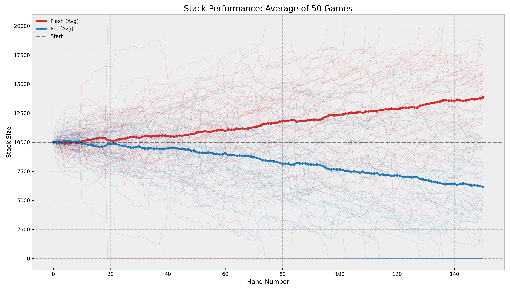

# PokerBench: A Longitudinal Multi-Agent Framework for Evaluating Strategic Coherence and Game Theory Optimal (GTO) Adherence in Large Language Models

## The Imperative for Dynamic Evaluation in Imperfect-Information Domains

**PokerBench** establishes a high-frequency, adversarial, and imperfect-information environment: a No-Limit Texas Hold’em (NLTH) tournament. PokerBench places frontier models — including Claude Opus, Gemini 3, and GPT-5.2 - into direct competition. This introduces a "Theory of Mind" requirement; agents must not only manage their own state (chips, cards) but also model the epistemic states and strategies of hostile actors [cite: 1].

The complexity of NLTH, with a game tree exceeding $10^{160}$ decision points, forces the LLM to integrate probability estimation (pot odds), resource management (stack depth), and deceptive capability (bluffing) simultaneously [cite: 2].

## Objectives and Benchmark Scope

The primary objective of PokerBench is to quantify the "Strategic Coherence" of LLMs. Strategic coherence is defined here as the ability of an agent to maintain a consistent policy (e.g., Game Theory Optimal or Exploitative) without violating logical constraints or succumbing to hallucinatory drift over a sequence of 150 hands per game.

| Evaluation Dimension | Description |
| :--- | :--- |
| **Longitudinal Stability** | Performance consistency over (N games * M hands). |
| **Epistemic Modeling** | Tracking hidden information (opponent cards) based on public signals (bets). |
| **Resource Scarcity** | Optimizing chip stack utility (Expected Value) under ruin risk. |
| **Adversarial Adaptation** | Adjusting strategy based on opponent "tilt" or aggression levels. |

The benchmark simulates a large number of independent games, each lasting 150 hands or until one player accumulates all chips. This scale is necessary to dampen the extreme variance inherent in NLTH and achieve statistical significance in the primary metric: Big Blinds won per 100 hands (BB/100) [cite: 3].

## Important Notes

All of the runs are stored in JSON files in this repo and can be inspected. You may also generate your own runs using pokerbench.py. Contributions and bug-fixes are welcome.

Try out https://pokerbench.adfontes.io/ for game visualizations, stats, etc.

**Sources:**
1. [Suspicion-Agent: Playing Imperfect Information Games with Theory of Mind Aware GPT-4](https://arxiv.org/html/2309.17277v3)
2. [PokerBench: Training Large Language Models to become Professional Poker Players](https://arxiv.org/html/2501.08328v2)
3. [Poker Variance Calculator](https://vertexaisearch.cloud.google.com/grounding-api-redirect/AUZIYQHFP73s9113ny-e_5OUklK7TV3mTAeic0342iPoZyIUsF-zYPqjXsL5gesMkw_LN97lopBa0zYzB7fbtPI-6DCE8FCqAsK-3bzN-oQ25qjsG6ZEORtkljZrTAe9Z464mxcBG6MeSc_X4Hb8)
