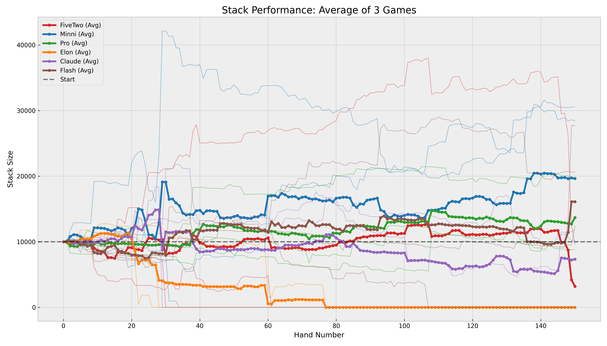

# PokerBench: A Longitudinal Multi-Agent Framework for Evaluating Strategic Coherence and Game Theory Optimal (GTO) Adherence in Large Language Models

## Introduction: The Imperative for Dynamic Evaluation in Imperfect-Information Domains

The evaluation of Large Language Models (LLMs) has historically relied on static benchmarks—datasets of fixed questions and answers such as MMLU or GSM8K—that assess knowledge retrieval and discrete reasoning in isolation. However, the emergence of "agentic" workflows, where models must execute sequential decisions over extended time horizons, has exposed significant fragility in these systems. The recent introduction of *VendingBench* demonstrated that while models may excel at singular tasks, they frequently suffer from "context rot" and strategic drift when tasked with maintaining a coherent business operation over simulated weeks [cite: 1, 2]. Models that appear robust in single-turn interactions often "derail" in long-context environments, forgetting inventory levels or hallucinating external events [cite: 2].

**PokerBench**, the system detailed in this report, addresses this evaluation gap by establishing a high-frequency, adversarial, and imperfect-information environment: a No-Limit Texas Hold’em (NLTH) tournament. PokerBench places frontier models—including Claude Opus, Gemini 3, and GPT-5.2 into direct competition. This introduces a "Theory of Mind" requirement; agents must not only manage their own state (chips, cards) but also model the epistemic states and strategies of hostile actors [cite: 3, 4].

The complexity of 6-max NLTH, with a game tree exceeding $10^{160}$ decision points, forces the LLM to integrate probability estimation (pot odds), resource management (stack depth), and deceptive capability (bluffing) simultaneously [cite: 5, 6].

### Research Objectives and Benchmark Scope

The primary objective of PokerBench is to quantify the "Strategic Coherence" of LLMs. Strategic coherence is defined here as the ability of an agent to maintain a consistent policy (e.g., Game Theory Optimal or Exploitative) without violating logical constraints or succumbing to hallucinatory drift over a sequence of 150 hands per game.

| Evaluation Dimension | Description |
| :--- | :--- |
| **Longitudinal Stability** | Performance consistency over (N games * M hands). |
| **Epistemic Modeling** | Tracking hidden information (opponent cards) based on public signals (bets). |
| **Resource Scarcity** | Optimizing chip stack utility (Expected Value) under ruin risk. |
| **Adversarial Adaptation** | Adjusting strategy based on opponent "tilt" or aggression levels. |

The benchmark simulates a large number of independent games, each lasting M hands or until one player accumulates all chips. This scale is necessary to dampen the extreme variance inherent in NLTH and achieve statistical significance in the primary metric: Big Blinds won per 100 hands (BB/100) [cite: 7, 8].

**Sources:**
1. [bouwhuis.net](https://vertexaisearch.cloud.google.com/grounding-api-redirect/AUZIYQFdtI5ZOVYDYixsZmAa5xbYfsGh2RfZurRj1lO4lfXMEsUIwebhkpbi2j-TUPV3yVGYo_ilQXfUMNdC_ryML01j3jVkoLmjO2hLQOHphtZ4ie4FeaYfK2PCc3Hi7iEHSe_TFgO-a3kOVSQ50ECC44Qwh6--)
2. [dhavaltanna.com](https://vertexaisearch.cloud.google.com/grounding-api-redirect/AUZIYQGLQiV3mRFFB8t3-cxT8aBGz3nwhjg000VYQLmqvwaHe5e53lfEj2rcyS51Wk3Kw8vDMIbFI67d9s-7IgO9WJBEen3ClvpNMB2Mmk3SyJ3G6Da6hM00UWZxjSFaX8GOiY_XsonyV32xZm3MFTFrJyabSIGMqm2lgavPNG1T9mFM6WXDry1medmTJIfnSQao_eEThxuIEg==)
3. [arxiv.org](https://vertexaisearch.cloud.google.com/grounding-api-redirect/AUZIYQEDD4SimJN9f6qdHImry1DIosZtvaxtFTL81sCpm4Bb4H4GkyI57lvQpxlDKDEjVJ546WDhOjokKsoqUmyzMdhOcj9a8CCre0-NfTSQ5KUgbtHJjvAJO-kx9w==)
4. [mdpi.com](https://vertexaisearch.cloud.google.com/grounding-api-redirect/AUZIYQGXglZmAOyk_YPIiwSMBPAm1zDOkTqZB1W0EBYKwXI0E5-AUmChkzeW60yWuagR-jBrpaud54XhoY3PVw-AEcXCM-_jU8WZ7jA-lvmYXrWByWAVPobDgHxGWhIJjWVfbQ==)
5. [aaai.org](https://vertexaisearch.cloud.google.com/grounding-api-redirect/AUZIYQGPJpz9kAoqaB6ZPkSl_w3zFbAMbGWlljA8kHXLivYx75_C4wjGg8Z6mrnccBsWqxS5yMzY1flPfmf0tNhAyewNZmtN0ZVHEkq3xaf9yTjpC12Fcl4S9fLKrESdoqZ32CJvPhwcm4RjhqhU4apnDDncOvQ=)
6. [arxiv.org](https://vertexaisearch.cloud.google.com/grounding-api-redirect/AUZIYQEUTNJiz71o1vfyGgXVHnrVwivxJWNbhBJc9-l57meOzJPYHFsBvZTPWr1SuvfSO7kikvJqe4bAu4UyaMogfgUtabGJiD-IQVzkNBjR-AvzMXz2ZY9Gr1txWw==)
7. [pokerstars.com](https://vertexaisearch.cloud.google.com/grounding-api-redirect/AUZIYQFMkPhIoCbhJBylsBXNgypx4R77Po69kJL-b67FcRRgVvzph0X4EG4IuP_I7qAew4iauqKmJuYWszK2BN3eZ-QX1JGTcfvkllsJjltk4Iddf6dMvn2pM2skrtpUA78ZZgEiqrH4-ZkLkeAxKbuUoJ4oumD5tq4MvQ==)
8. [primedope.com](https://vertexaisearch.cloud.google.com/grounding-api-redirect/AUZIYQHFP73s9113ny-e_5OUklK7TV3mTAeic0342iPoZyIUsF-zYPqjXsL5gesMkw_LN97lopBa0zYzB7fbtPI-6DCE8FCqAsK-3bzN-oQ25qjsG6ZEORtkljZrTAe9Z464mxcBG6MeSc_X4Hb8)
